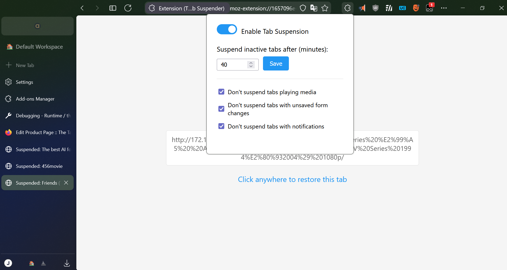
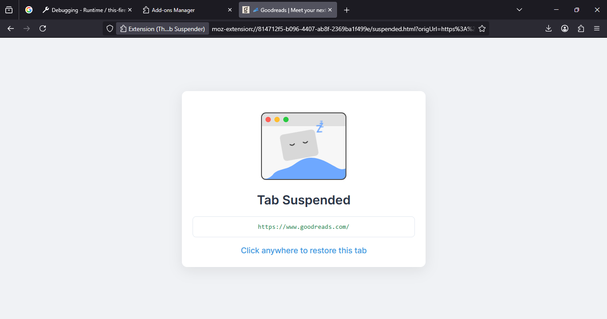

# The Tab Suspender

A Firefox/Chrome extension that automatically suspends inactive tabs after a specified time to save memory. Unlike Firefox's native tab discarding, and popular addons like Auto Tab Discard, this extension shows a custom suspended page that you need to click to reload - preventing accidental tab reloads when you mistakenly click on a tab.

## Firefox Addons Store Link
- It's live! <a href="https://addons.mozilla.org/en-US/firefox/addon/the-tab-suspender/">Download it on Firefox</a>

## Chrome Web Store Link
- Extension under review.
<!-- - It's live! <a href="https://chrome.google.com/webstore/detail/the-tab-suspender/jfjgjgjgjgjgjgjgjgjgjgjgjgjgjgjg">Download it on Chrome</a> -->

## Screenshots

  

  

## New features and Changes in v1.7 release
- Enable native discard API, same as Auto Discard Tab, without removing suspended page.
- Now saves significantly more memory.
- Added new suspended tabs Migration logic so suspended tabs won't be lost in future updates. (This will take effect from next update)
- Ported extension to Chromium. (Currently under review).

## New features and Changes in v1.6 release
- Added new Experimental feature to save screenshots for suspended tabs, with configurable quality settings.
- Refactored code to improve performance and reduce I/O operations and memory usage.

## New features and Changes in v1.5 release
- Settings are synced with your Firefox profile.
- Allow exporting, importing whitelisted sites.
- Add keyboard shortcuts for suspend, unsuspend and whitelist.
- Add 'Ignore pinned tabs' option.
- Original website favicon is now displayed in suspended page.
- One-time migration added for migrating whitelisted sites from local to Firefox profile.
- Bug fixes and refactor.

## New features and Changes in v1.4 release
- Added Suspend this page to context menu options.
- Replaced Suspended: to 'zzz' icon in Tab title for suspended tabs.

## New features and Changes in v1.2 release
- Major UI Redesign: Completely overhauled the user interface for a more intuitive and visually appealing experience.
- SVG with Dark/Light Themes: Added support for SVG graphics with seamless dark and light theme switching to match your browser's appearance.
- ZZZ Animation: Introduced a playful "ZZZ" animation to visually indicate when tabs are suspended.
- Whitelist Buttons in Popup: Added convenient whitelist buttons to the popup for quick management of excluded tabs.
- Resolved various bugs to improve stability and performance.

## New features and Changes in v1.1 release
- Added ability to whitelist site by domain or page (Access it via context menu)
- Added dark mode (Toggle it in popup settings)

## Features

- Automatically suspends inactive tabs after a customizable time period (default 40 minutes)
- Shows a clean suspended page with the original URL and title
- Requires explicit click to restore the tab - no more accidental tab reloads!
- Enable/disable suspension with a simple toggle
- Only suspends http/https pages (ignores about:, file:, etc.)
- Keeps the active tab running even if inactive
- Smart tab protection:
  - Option to prevent suspension of tabs playing audio/video
  - Option to prevent suspension of tabs with unsaved form changes
  - Option to prevent suspension of tabs with notification permissions
  - Option to prevent suspension of pinned tabs
- Persistent suspension state across browser restarts
- Remembers your settings between browser restarts
- Lightweight and efficient

## How it Works

The extension monitors your tabs and identifies which ones are inactive. When a tab hasn't been active for the specified time period (default 40 minutes), it replaces the tab content with a lightweight suspended page that shows the original URL and title.

Key behaviors:
- The currently active tab is never suspended, even if you're not interacting with it
- Only http/https pages are suspended (browser pages like about:config are ignored)
- When you click anywhere on a suspended page, the original page is restored
- If tab protection options are enabled, the extension checks for:
  - Audio/video playback using Firefox's native audio detection
  - Unsaved form changes by comparing form input values with their defaults
  - Granted notification permissions using the Notifications API
- Suspended tabs remain suspended after browser restart until explicitly restored
- Suspension state is saved locally and restored when browser restarts

## Usage

1. Install the extension
2. Click the extension icon to access settings
3. Set your preferred suspension time (1-1440 minutes)
4. Configure protection options:
   - Prevent suspension of media-playing tabs
   - Prevent suspension of tabs with unsaved forms
   - Prevent suspension of tabs with notifications
   - Prevent suspension of pinned tabs
5. Toggle suspension on/off as needed
6. That's it! Inactive tabs will be suspended automatically

When a tab is suspended, you'll see a simple page showing the original URL. Click anywhere on the page to restore the tab to its original state. This behavior persists even after browser restarts - suspended tabs stay suspended until you choose to restore them.

## Build Instructions
- Run `npm install --save-dev` to install dependencies
- Run `npm run build` to build the extension
- 
## Future Improvements

- Domain whitelist/blacklist functionality (Added)
- Per-site suspension rules
- Tab suspension statistics
- Keyboard shortcuts for manual suspension/restoration (Added)
- Dark mode for suspended page (Added)

## Contributing

Contributions are welcome! Feel free to submit issues and pull requests.

## License

MIT License

Copyright (c) 2024

Permission is hereby granted, free of charge, to any person obtaining a copy
of this software and associated documentation files (the "Software"), to deal
in the Software without restriction, including without limitation the rights
to use, copy, modify, merge, publish, distribute, sublicense, and/or sell
copies of the Software, and to permit persons to whom the Software is
furnished to do so, subject to the following conditions:

The above copyright notice and this permission notice shall be included in all
copies or substantial portions of the Software.

THE SOFTWARE IS PROVIDED "AS IS", WITHOUT WARRANTY OF ANY KIND, EXPRESS OR
IMPLIED, INCLUDING BUT NOT LIMITED TO THE WARRANTIES OF MERCHANTABILITY,
FITNESS FOR A PARTICULAR PURPOSE AND NONINFRINGEMENT. IN NO EVENT SHALL THE
AUTHORS OR COPYRIGHT HOLDERS BE LIABLE FOR ANY CLAIM, DAMAGES OR OTHER
LIABILITY, WHETHER IN AN ACTION OF CONTRACT, TORT OR OTHERWISE, ARISING FROM,
OUT OF OR IN CONNECTION WITH THE SOFTWARE OR THE USE OR OTHER DEALINGS IN THE
SOFTWARE.
